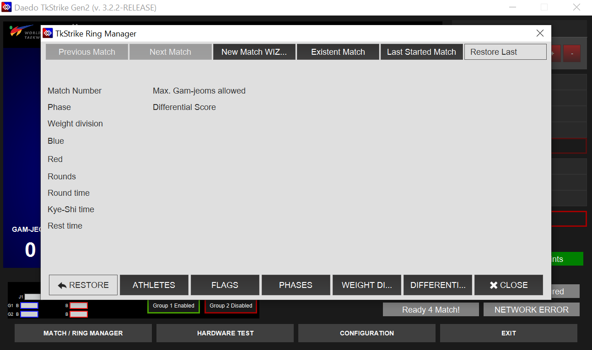
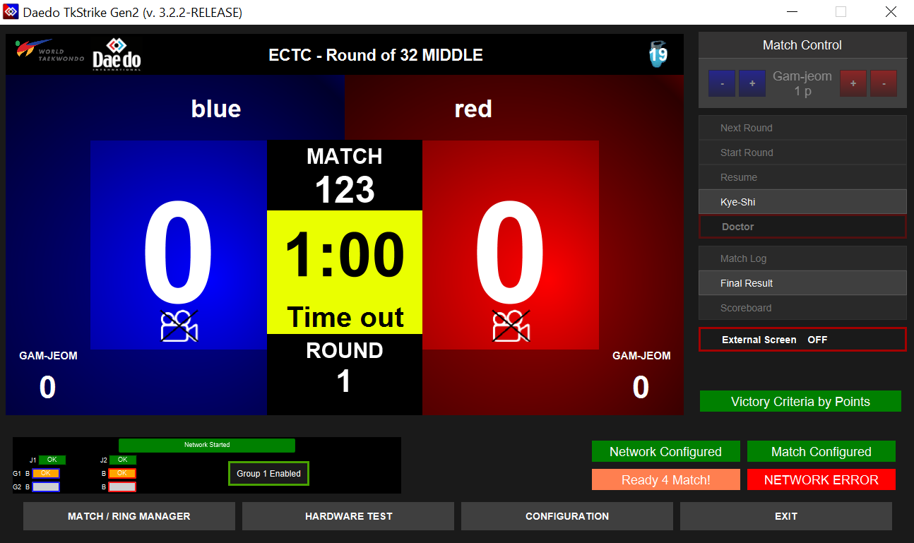
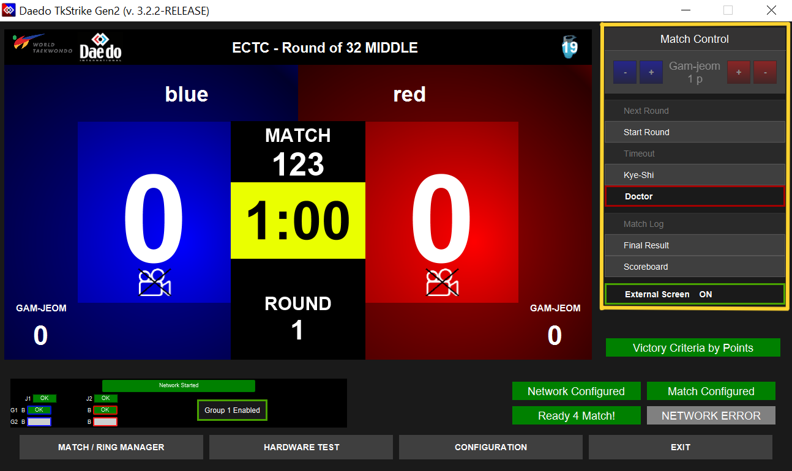
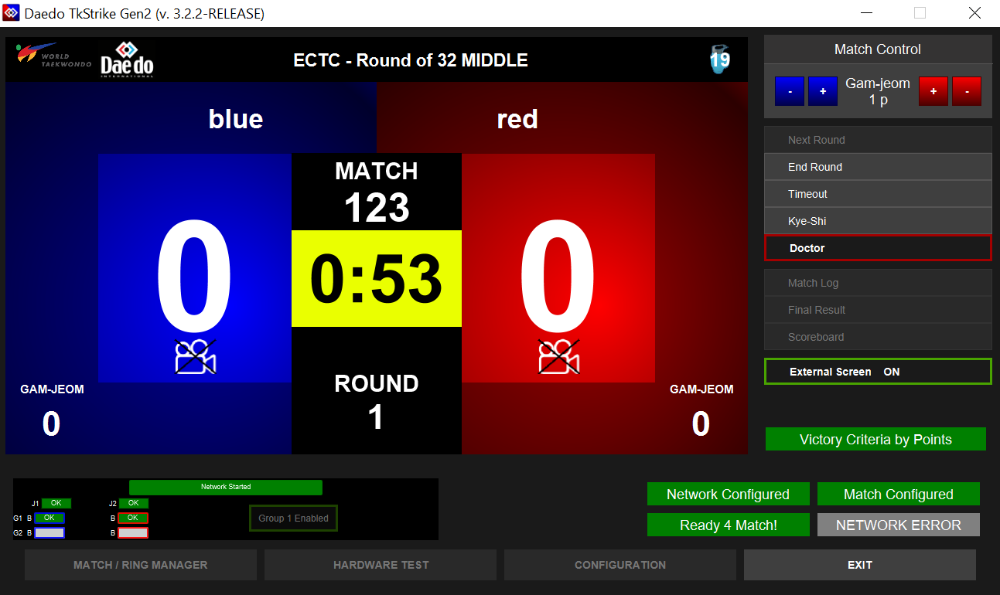
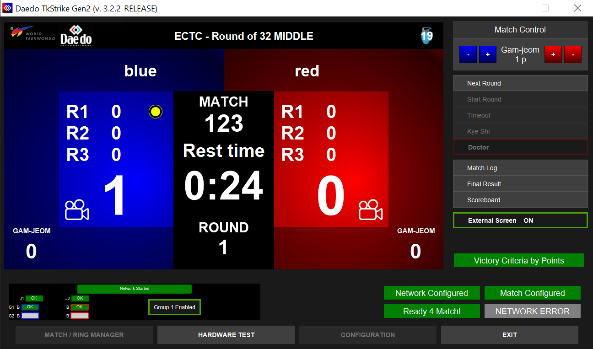
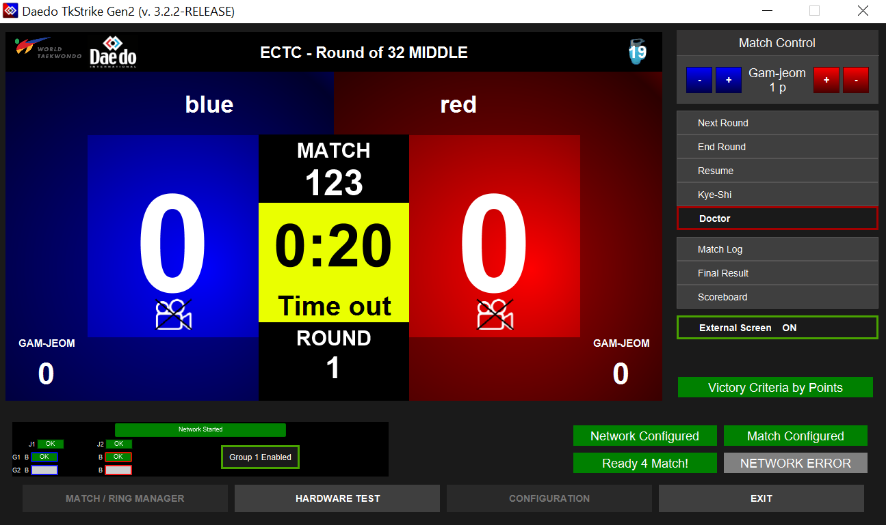
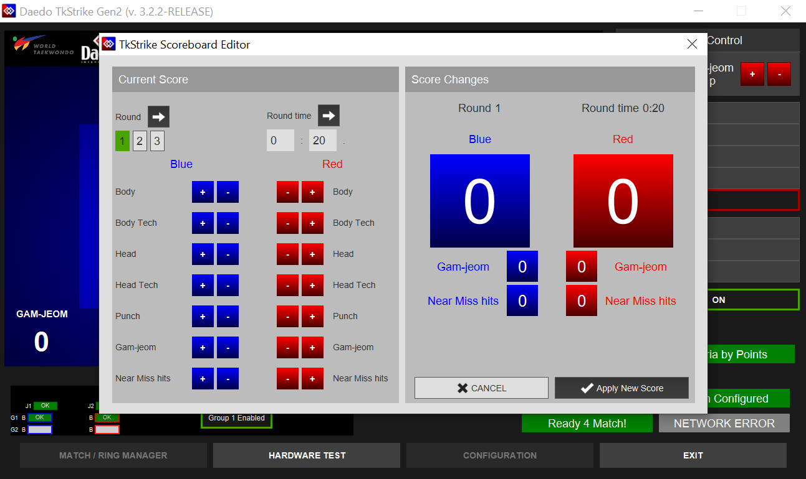
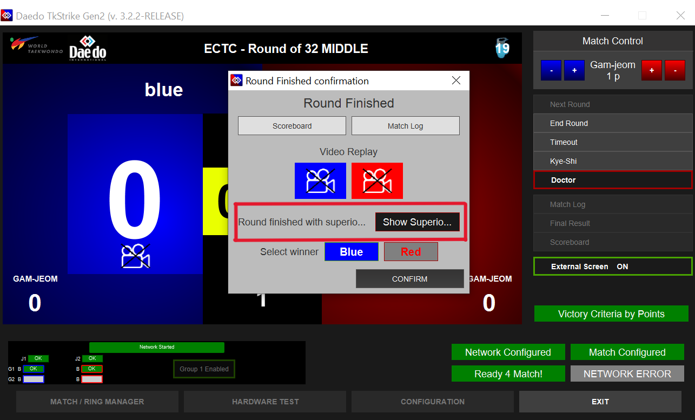

# Operating TkStrike
### Instructions for operating the TkStrike software including setting up and running matches

When starting up the TkStrike software, the software will load the home screen as shown below.

Interactions with the software are all done via the bottom menu (software/match configuration), or via the right sidebar (match control). This page primarily focuses on match configuration and control rather than software configuration. 

## Setting up a Match

Once the ring is set up and ready to receive sparring matches, a new match can be set up. Come back to this step for assistance with creating a new match.

### Step 0: New Match Wizard
To set up a new match, click **New Match WIZARD** - the third button on the top bar in the Match/Ring Manager popup window.
This button is also usually the first non-grayed out button in the top bar, and usually shows up as **New Match WIZ...**

### Step 1: Match Number
After selecting "New Match Wizard", a new popup window should show up prompting the entry of the match number.

If possible, enter the same match number as shown in the Tournament Management System (TMS), but any number can be entered. 
Click on **NEXT** once it is entered.

### Step 2: Round Number
Select the correct round by clicking on it. The round information can also be read from the Tournament Management System (TMS).
This information is most important to match for semifinal and final rounds, since some competitions may have different rules in play for those rounds. 
However, it is best to try to match the round number from TMS whenever possible.

Click on **NEXT** once it is entered.

### Step 3: Contest Name
Select the contest name. For this step, **ECTC** is the appropriate contest type.
::: warning
If you do not see **ECTC** as an option, please call for Daedo Tech support
:::

Click on **NEXT** once it is entered.

### Step 4: Gender Select
Select the athlete's gender as specified in the TMS. The athlete gender as well as weight division (Step 5) affect the scoring thresholds for the Daedo E-Hogus.

Click on **NEXT** once it is entered.

### Step 5: Weight Class
Select the athlete's weight class as specified in the TMS.
::: note
Confirm with the center referee as needed. The athlete may be fighting up a weight class or competing outside of the order specified in the TMS
:::

Click on **NEXT** once it is entered.

### Step 6: Athlete Name
Type in the athlete's names. Only the **"Name"** field is required; all other fields are optional.
The actual athlete's name or school name is optional. For ECTC tournaments, all information inputted here only affects the external ring monitor display. Placeholder names such as "blue", "red", "b", "r" are ok to use.

Click on **NEXT** once it is entered.

### Step 7: Rules Check
Confirm the match rules. For the most part, this should just be checking that values in these fields line up with the current rules. In particular, check that the round time is correct as well as that **Victory Criteria by Rounds** is set. Round time in particular is subject to change from tournament to tournament.

::: danger STOP
Check to make sure the **Max Gam-jeoms allowed** field is set to **5** (current value as of 2025-26 season).

There is a bug in the software that does not carry the correct value over from the rules settings.
:::

All rules in these fields as of the 2025-26 season should be set to:
* **Rounds**: 3
* **Round Time**: Determined by tournament rules. This value should be broadcast by head table.
* **Golden Point**: Disabled
* **Max Gam-jeoms Allowed**: 5
* **Kye-Shi Time**: 1:00
* **Is PARA Taekwondo Match**: Disabled
* **Victory Criteria by Rounds**
* **Rest Time**: 0:30
* **Differential Score**: 12

Click on **FINISH** once it is entered.

### Step 8: Confirmation
Confirm the match setup and rules one last time

If everything looks good, click on **CLOSE**, and the match will be configured and ready to start.

### Ready for Match

If the ring is configured for an A or B team match, the screen may look like the image below once the match is configured.

The yellow "Ready 4 Match!" and red **NETWORK ERROR** in the bottom right corner, along with the yellow boxes in the bottom left just signify that the E-Hogu transmitters have not yet been connected to the hogus.
The center ref will plug the transmitters into the hogus prior to the match starting.

If everything is plugged in and configured correctly, then the screen will show that it is ready to start the match like below. Note than in the below image, right hand menu (highlighted with a yellow square), no longer has the "Start Round" button grayed out.

## Hardware Test

::: tip
This step is primarily relevant if you are running an A or B team ring. C team rings will typically only request a hardware test if the corner judge controllers are acting up. If this step is not relevant for the ring setup, it can be skipped.
:::

Click on **Hardware Test** in the bottom bar. A popup window will show up like the one below.

As the athletes kick each others' hogu, the images of the hogu in the hardware test screen should light up red/blue.
Similarly, if corner judges press buttons on their judge controllers, the buttons on the images of the judge controllers should light up red/blue. Note that there is the option for 3 judge controllers to be connected to TkStrike, but ECTC only uses 2 corner judges.

::: info
If the circle next to the hogus is red, then the hogu transmitter is not properly connected to the TkStrike software. If the circle is yellow, that means the hogu transmitter is connected, but it doesn't think it's connected to a hogu. If the circle is green, everything is good to go.

It can take a couple seconds between connecting the hogu transmitter to the hogu for the circle to turn green.
:::

## Running a Match

::: tip
The most important job during a match is to follow what the center ref says and communicate with the center ref. The center ref is the one directing the match flow.
:::

Start the round on the referee's command. 
To start a round, click **"Start Round"** on the right-hand menu. Alternatively, the hotkey "Enter" can be used.

::: warning
If the **"Start Round"** button is grayed out or the round cannot be started for a different reason, please call for Daedo Tech support. 
If this is for an A or B team ring, ensure all the E-Hogu controllers are connected.
:::

Once the round is running, the timer in the center should start counting down:

Scoring is controlled by the judge controllers and/or the E-Hogus. The Tk-Strike software will also automatically start the break period after round 1 and will advance to round 2 (pending user input to start) after that.
Once the break period starts, the screen will show an overview of the round scores with total rounds won so far, as well as a countdown for the rest time remaining.

### Pausing the Match
If the referee calls for a break ("kalyeo"), click on **Timeout** or press "Space" to pause the match in TkStrike. **Wait approximately 1 second after the referee makes the call, as kicks that start before timeout is called but land after are legal and should be allowed to score**. Pausing TkStrike before the kick lands prevents it from registering.

When the round is paused, the screen should look like the one below (note the "Time out" banner under the countdown clock)

### Giving a Penalty
If the referee needs to give a penalty ("gam-jeom") to an athlete, they will first call a timeout. Once the match is paused, click on the correct **+** button next to the **Gam-jeom 1p** above the right-hand menu.

For example, if the center referee gives a penalty to the athlete in blue, click on the **blue +**. Click on **OK** to confirm once the pop-up confirmation dialog shows up.

### Medical Timeout
If medics are required at the ring, the referee will pause the match and call for a medic. When the referee pauses the match, the **Timeout** button should be clicked (or "Space" pressed).
If the referee issues the "Kye-Shi" command (medical timeout), click on the **Kye-Shi** button in the right-hand menu.

## Scoreboard
If the round number, timer, or score needs to be edited mid-match, then the **Scoreboard** should be used to do this.
This may come up if, for example, a coach protests a head kick and 3 points need to be awarded to an athlete, or if an athlete executed a technical head/body kick and points need to be added to their score.

The button to access the scoreboard can be found in the right-hand bar. The scoreboard should only be accessed during **time-out AFTER a round has been started**. 

Once the scoreboard is opened, it should look like the image below.

On this page, the scores for either athlete can be changed. Pressing any of the blue or red buttons on the left pane to change athlete's scores will cause the score change to be updated in the "Score Changes" pane on the right.

To change the time left in the round or the round number, click or enter the appropriate value in the left-hand pane, then click on the arrow next to either "Round" or "Round time" for the changes to propagate into the right-hand pane.

Once the appropriate edits to the score have been made, click on **Apply New Score** in the bottom right to return to the main screen.

## Round End
At the end of a round's allotted time, the round will have a winner. A round can be won by an athlete having more points than their opponent at the end of the round, by an athlete having a higher differential score (point gap), or by the athlete's opponent reaching the maximum penalties (gam-jeoms) allowed in the round. At the end of the round, the software will show a confirmation screen showing the projected winner.

In the event that athlete scores are tied at the end of the round, the software will attempt to break the tie, and a confirmation screen will show up like below

**Always click on "Show Superiority" for the round winner to be displayed correctly on the external screen**

Always wait for the center ref to confirm that the round winner is indeed correct **before** clicking on CONFIRM. In the event that superiority (judge's choice) needs to be used to determine a round winner, the center ref will communicate whether "Blue" or "Red" should be clicked on the tie confirmation screen.

Regardless of how the round ends, the center referee will call the athletes back to the mat when the rest time is over. Start the next round on their command and continue normally.

