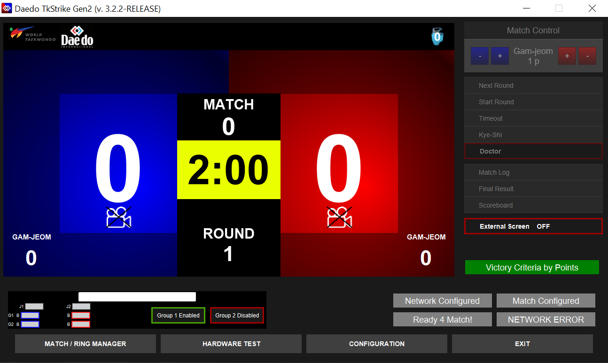
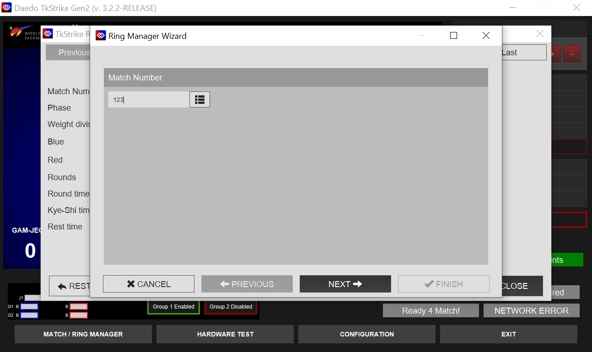
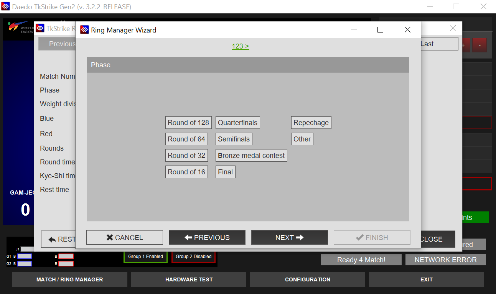
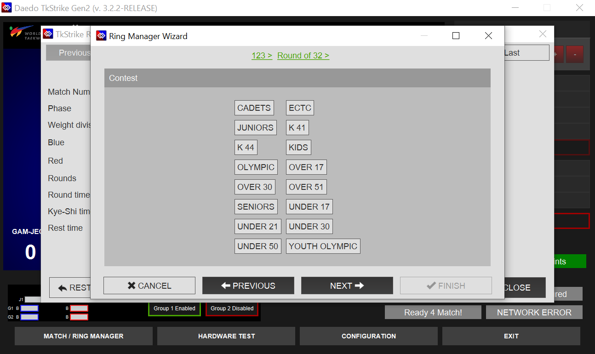
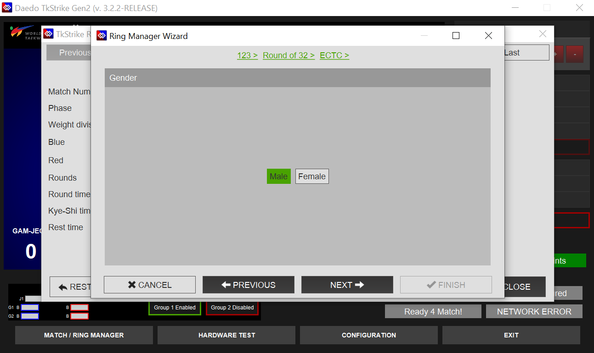
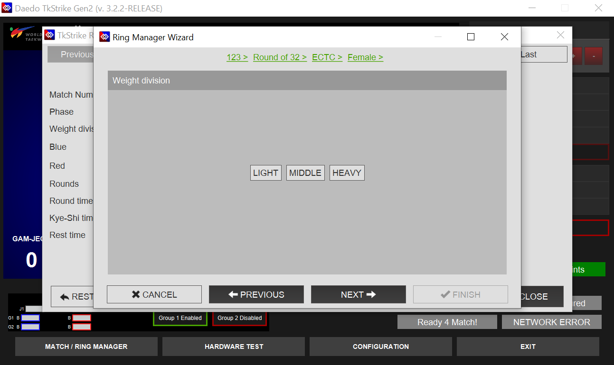
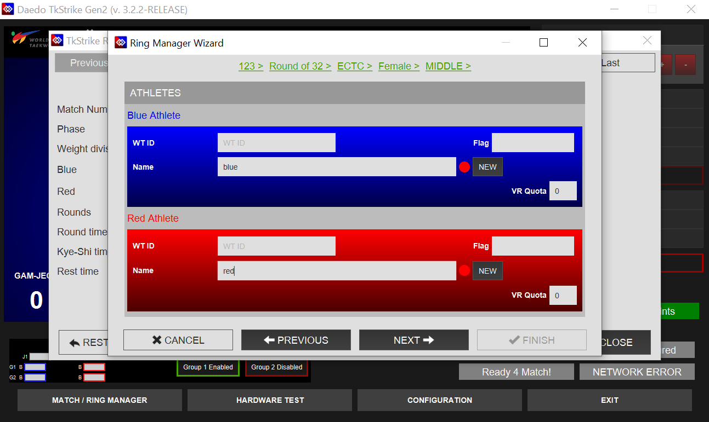
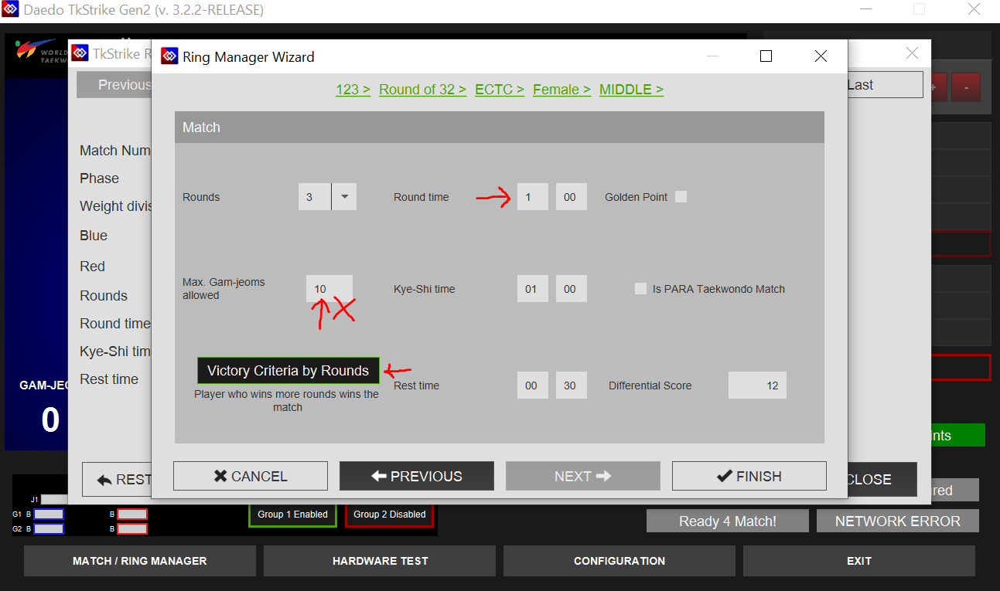
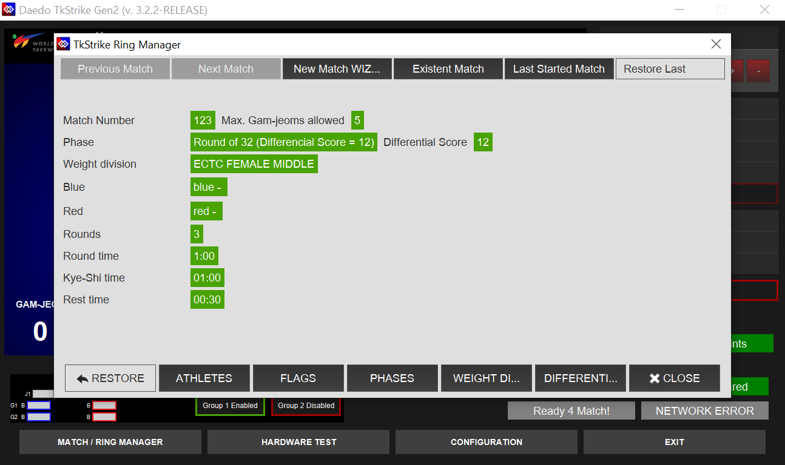
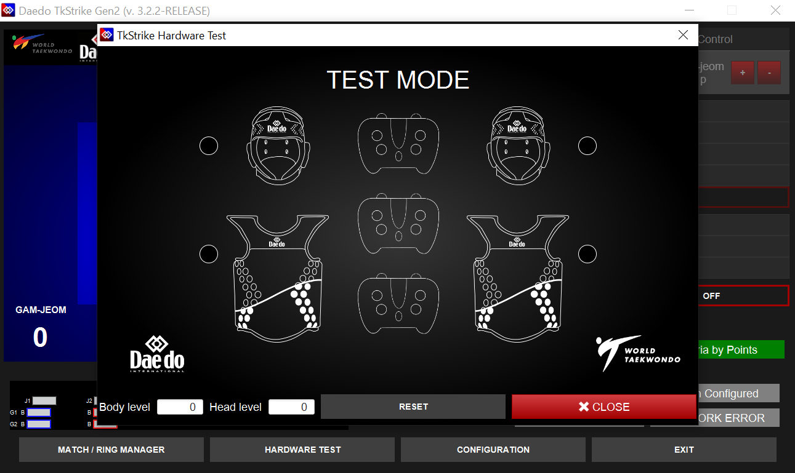

# Operating TkStrike
### Instructions for operating the TkStrike software including setting up and running matches

When starting up the TkStrike software, the software will load the home screen as shown below.

Interactions with the software are all done via the bottom menu (software/match configuration), or via the right sidebar (match control). This page primarily focuses on match configuration and control rather than software configuration. 

## Setting up a Match

Once the ring is set up and ready to receive sparring matches, a new match can be set up. Come back to this step for assistance with creating a new match.

### Step 1
To start, click **MATCH/RING MANAGER** - the leftmost button on the bottom bar. A popup window will show up prompting you to enter the match number.

If possible, enter the same match number as shown in the Tournament Management System (TMS), but any number can be entered. 
Click on **NEXT** once it is entered.

### Step 2
Select the correct round by clicking on it. The round information can also be read from the Tournament Management System (TMS).
This information is most important to match for semifinal and final rounds, since some competitions may have different rules in play for those rounds. 
However, it is best to try to match the round number from TMS whenever possible.

Click on **NEXT** once it is entered.

### Step 3
Select the contest name. For this step, **ECTC** is the appropriate contest type.
::: warning
If you do not see **ECTC** as an option, please call for Daedo Tech support
:::

Click on **NEXT** once it is entered.

### Step 4
Select the athlete's gender as specified in the TMS. The athlete gender as well as weight division (Step 5) affect the scoring thresholds for the Daedo E-Hogus.

Click on **NEXT** once it is entered.

### Step 5
Select the athlete's weight class as specified in the TMS.
::: note
Confirm with the center referee as needed. The athlete may be fighting up a weight class or competing outside of the order specified in the TMS
:::

Click on **NEXT** once it is entered.

### Step 6
Type in the athlete's names. Only the **"Name"** field is required; all other fields are optional.
The actual athlete's name or school name is optional. For ECTC tournaments, all information inputted here only affects the external ring monitor display. Placeholder names such as "blue", "red", "b", "r" are ok to use.

Click on **NEXT** once it is entered.

### Step 7
Confirm the match rules. For the most part, this should just be checking that values in these fields line up with the current rules. In particular, check that the round time is correct as well as that **Victory Criteria by Rounds** is set. Round time in particular is subject to change from tournament to tournament.

::: danger STOP
Check to make sure the **Max Gam-jeoms allowed** field is set to **5** (current value as of 2025-26 season).

There is a bug in the software that does not carry the correct value over from the rules settings.
:::

All rules in these fields as of the 2025-26 season should be set to:
* **Rounds**: 3
* **Round Time**: Determined by tournament rules. This value should be broadcast by head table.
* **Golden Point**: Disabled
* **Max Gam-jeoms Allowed**: 5
* **Kye-Shi Time**: 1:00
* **Is PARA Taekwondo Match**: Disabled
* **Victory Criteria by Rounds**
* **Rest Time**: 0:30
* **Differential Score**: 12

Click on **FINISH** once it is entered.

### Step 8
Confirm the match setup and rules one last time

If everything looks good, click on **CLOSE**, and the match will be ready to start.

## Hardware Test

::: tip
This step is primarily relevant if you are running an A or B team ring. C team rings will typically only request a hardware test if the corner judge controllers are acting up. If this step is not relevant for the ring setup, it can be skipped.
:::

Click on **Hardware Test** in the bottom bar. A popup window will show up like the one below.

As the athletes kick each others' hogu, the images of the hogu in the hardware test screen should light up red/blue.
Similarly, if corner judges press buttons on their judge controllers, the buttons on the images of the judge controllers should light up red/blue. Note that there is the option for 3 judge controllers to be connected to TkStrike, but ECTC only uses 2 corner judges.

::: info
If the circle next to the hogus is red, then the hogu transmitter is not properly connected to the TkStrike software. If the circle is yellow, that means the hogu transmitter is connected, but it doesn't think it's connected to a hogu. If the circle is green, everything is good to go.

It can take a couple seconds between connecting the hogu transmitter to the hogu for the circle to turn green.
:::

## Running a Match

::: tip
The most important job during a match is to follow what the center ref says and communicate with the center ref. The center ref is the one directing the match flow.
:::

Start the round on the referee's command. 
To start a round, click **"Start Round"** on the right-hand menu. Alternatively, the hotkey "Enter" can be used.

::: warning
If the **"Start Round"** button is grayed out or the round cannot be started for a different reason, please call for Daedo Tech support. 
If this is for an A or B team ring, ensure all the E-Hogu controllers are connected.
:::

Scoring is controlled by the judge controllers and/or the E-Hogus. The Tk-Strike software will also automatically start the break period after round 1 and will advance to round 2 (pending user input to start) after that.

### Pausing the Match
If the referee calls for a break ("kalyeo"), click on **Timeout** or press "Space" to pause the match in TkStrike. **Wait approximately 1 second after the referee makes the call, as kicks that start before timeout is called but land after are legal and should be allowed to score**. Pausing TkStrike before the kick lands prevents it from registering.

### Giving a Penalty
If the referee needs to give a penalty ("gam-jeom") to an athlete, they will first call a timeout. Once the match is paused, click on the correct **+** button next to the **Gam-jeom 1p** above the right-hand menu.
For example, if the center referee gives a penalty to the athlete in blue, click on the **blue +**. Click on **OK** to confirm once the pop-up confirmation dialog shows up.

### Medical Timeout
If medics are required at the ring, the referee will pause the match and call for a medic. When the referee pauses the match, the **Timeout** button should be clicked (or "Space" pressed).
If the referee issues the "Kye-Shi" command (medical timeout), click on the **Kye-Shi** button in the right-hand menu.

